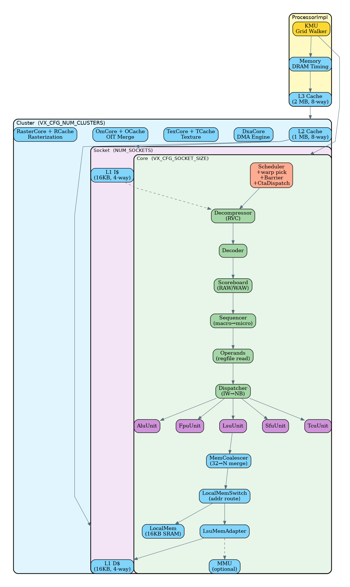
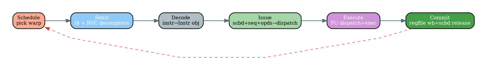
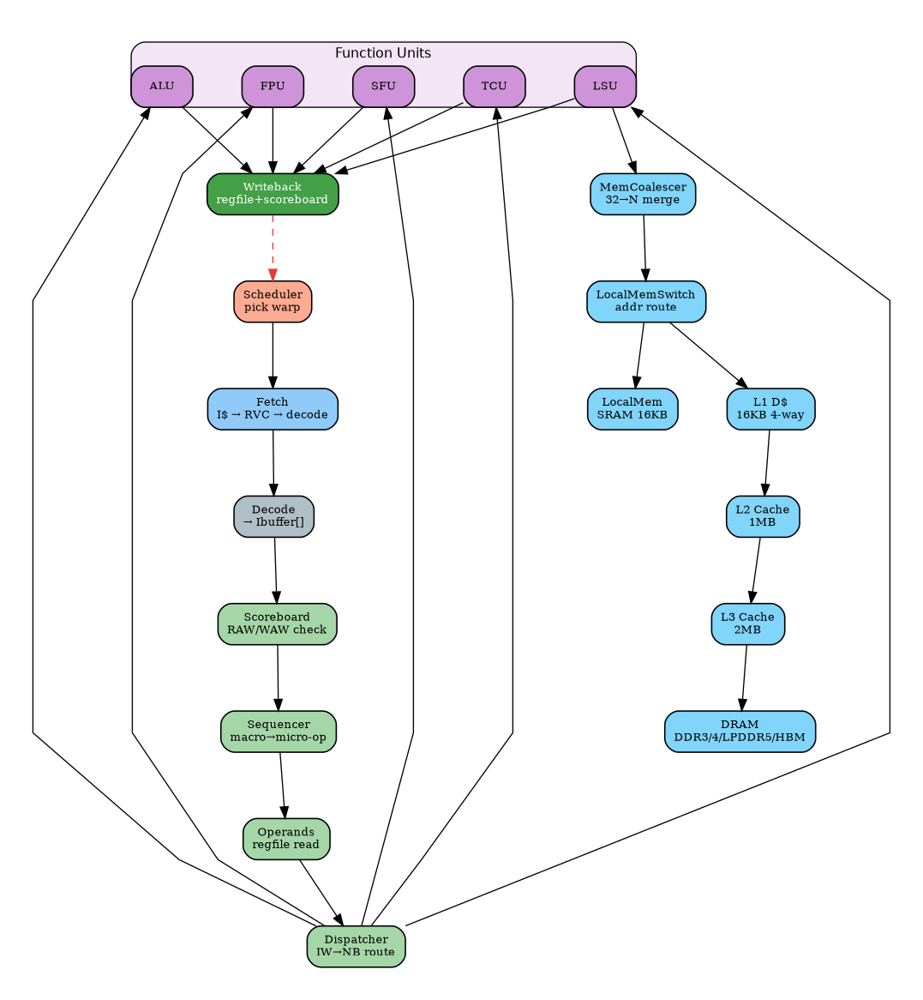
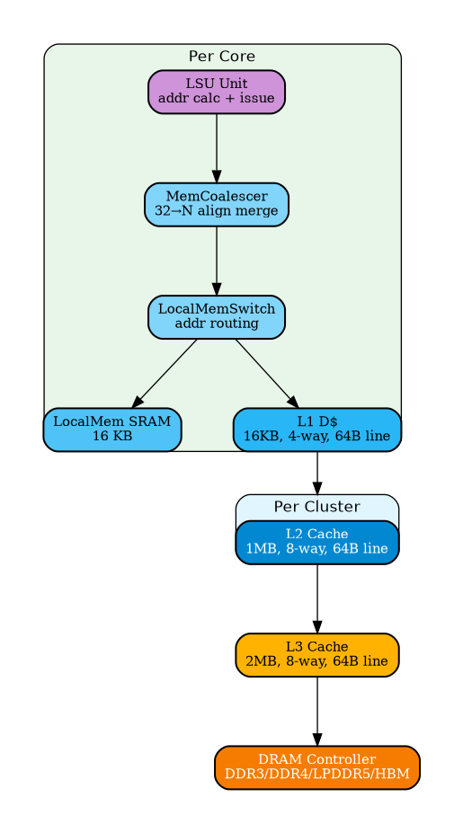
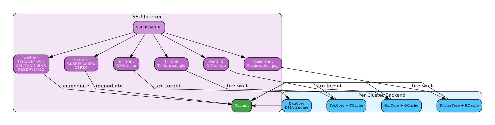
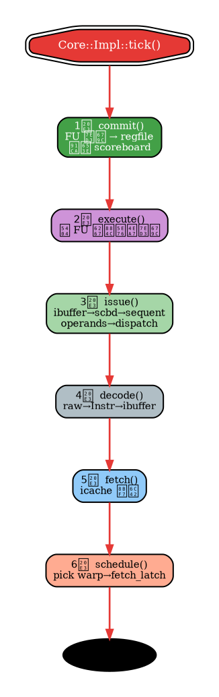

# Vortex simx GPGPU 模拟器微架构分析文档

> **代码路径**: `/home/daoyc/gpu-arc/vortex/sim/simx/`  
> **生成日期**: 2026-06-14  
> **分析范围**: 五级流水线、存储层次、模块层级、数据流

---

## 目录

1. [模块层级架构](#1-模块层级架构)
2. [五段流水线](#2-五段流水线)
3. [指令与数据流](#3-指令与数据流)
4. [存储层次](#4-存储层次)
5. [SFU 内部结构](#5-sfu-内部结构)
6. [单周期执行顺序](#6-单周期执行顺序)
7. [核心数据结构: instr_trace_t](#7-核心数据结构-instr_trace_t)
8. [关键参数默认值](#8-关键参数默认值)
9. [文件与模块映射表](#9-文件与模块映射表)
10. [常见配置修改方法](#10-常见配置修改方法)

---

## 1. 模块层级架构



```
Processor (顶层 Facade)
 └── ProcessorImpl
      ├── Kmu   (Grid Walker)
      ├── Memory  (DRAM timing)
      ├── L3 Cache  (2MB, 8-way)
      └── Cluster[NUM_CLUSTERS]
           ├── L2 Cache  (1MB, 8-way)
           ├── DxaCore / TexCore / OmCore / RasterCore (图形/DMA 后端)
           └── Socket[NUM_SOCKETS]
                └── Core[SOCKET_SIZE]
                     ├── Scheduler  (warp pick + BarrierUnit + CtaDispatcher)
                     ├── Decompressor (RVC) → Decoder → Scoreboard
                     ├── Sequencer[per warp] (macro→micro-op split)
                     ├── Operands[ISSUE_WIDTH] (regfile read)
                     ├── Dispatcher[FUType]  (issue width→narrow blocks)
                     ├── ALU | FPU | LSU | SFU | TCU
                     ├── MemCoalescer → LocalMemSwitch → LocalMem | L1D$
                     ├── LsuMemAdapter → MMU (optional)
                     └── Commit Arbiter → Writeback
```

---

## 2. 五段流水线



| 阶段 | 对应代码 | 功能 |
|------|----------|------|
| **Schedule** | `scheduler.cpp` | 从活跃 warp 中挑选就绪 warp, 推入 fetch_latch |
| **Fetch** | `core.cpp:fetch()` + `decompressor.cpp` | 发出 I$ 请求, 处理 RVC 压缩指令 |
| **Decode** | `decode.cpp` | 译码为 `Instr` 对象, 推入 per-warp ibuffer |
| **Issue** | `core.cpp:issue()` + `scoreboard.cpp` + `sequencer.cpp` + `operands.cpp` | 冒险检查 → macro→micro 分解 → 读寄存器 → 路由分发 |
| **Execute**| `dispatcher.cpp` + `alu/fpu/lsu/sfu/tcu_unit.cpp` | FU 执行, 产 dst_data |
| **Commit** | `core.cpp:commit()` + `operands.cpp:wb` | 写回 regfile, 释放 scoreboard |

### 反向流水线

Core 的 `tick()` 按 **逆序** (commit → execute → issue → decode → fetch → schedule) 调用各阶段:

- **commit 最先执行**: FU 结果本周期即可被 issue 的 RAW 检查看见
- 若正向执行则 commit 的结果隔一周期才可见, 浪费 1 个时钟周期

---

## 3. 指令与数据流



在 simx 中, 每条指令的状态贯穿全程并逐阶段填充 `instr_trace_t` 结构体.

### 7. 核心数据结构: `instr_trace_t`

| 字段 | 填充阶段 | 用途 |
|------|----------|------|
| `uuid` | 构造 | 全局唯一 ID |
| `cid / wid / cta_id` | Schedule | 核心 / Warp / CTA 标识 |
| `tmask` | Schedule | 活跃线程掩码 |
| `PC` | Schedule | 程序计数器 |
| `code` | Fetch | 原始指令字 |
| `fu_type / op_type` | Decode | 执行单元与操作类型 |
| `src_regs / dst_reg` | Decode | 源 / 目的寄存器描述符 |
| `src_data` | Issue (Operands) | 寄存器读取值 |
| `dst_data` | Execute | 执行结果 |
| `wb` | Decode | 是否需要写回 |

---

## 4. 存储层次



### 三级缓存 + 共享内存

| 层次 | 容量 | 关联度 | Cache Line |
|------|------|--------|------------|
| LocalMem (SRAM) | 16 KB | — (直接寻址) | — |
| L1 D$ | 16 KB | 4-way | 64 B |
| L2 Cache | 1 MB | 8-way | 64 B |
| L3 Cache | 2 MB | 8-way | 64 B |
| DRAM | — | DDR3/4/LPDDR5/HBM 时序模型 | — |

### 访存合并 (MemCoalescer)

见 `mem/mem_coalescer.cpp`, 核心流程:

1. 接收 **32 线程散列地址** (`input_size = 32`)
2. 每个地址按 `addr & ~(line_size-1)` 对齐到 Cache Line
3. 同一 Cache Line 内的请求**合并**为一个 (`output_size ≤ 32`)
4. **完美合并**: 32 个连续对齐地址 → 1 个请求 (128B, 跨 2 条 64B Cache Line)
5. **最差情况**: 32 个完全随机地址 → 32 个独立请求
6. AMO 原子操作**跳过合并** (RISC-V RVA 不保证合并安全性)

---

## 5. SFU 内部结构



SFU (Special Function Unit) 包含 6 个子单元, 按操作类型路由:

| 子单元 | 操作 | 延迟模型 |
|--------|------|----------|
| **WctlUnit** | TMC / WSPAWN / SPLIT / JOIN / BAR / PRED / WSYNC | 立即完成 |
| **CsrUnit** | CSRRW / CSRRS / CSRRC | 立即完成 |
| **DxaUnit** | DMA issue | fire-and-forget → DxaCore |
| **TexUnit** | 纹理采样 | fire-and-wait → TexCore |
| **OmUnit** | OIT 合并 | fire-and-forget → OmCore |
| **RasterUnit**| 光栅化弹出 | fire-and-wait → RasterCore |

---

## 6. 单周期执行顺序



```
Core::Impl::tick()
  │
  1️⃣  commit()    — FU 结果写回 regfile, 释放 scoreboard
  2️⃣  execute()   — 各 FU 执行, 产 dst_data
  3️⃣  issue()     — ibuffer → scoreboard → sequencer → operands → dispatcher
  4️⃣  decode()    — raw code → Instr 对象 → 推入 ibuffer
  5️⃣  fetch()     — 发出 icache 请求
  6️⃣  schedule()  — 挑选下一个 warp → fetch_latch_
  │
  └── next cycle
```

---

## 8. 关键参数默认值

> 配置源: `VX_config.toml` + `VX_types.toml`

| 参数 | 默认值 | 说明 |
|------|--------|------|
| `VX_CFG_NUM_CLUSTERS` | 1 | 集群数 |
| `VX_CFG_NUM_CORES` | 1 | 总核心数 |
| `VX_CFG_SOCKET_SIZE` | 1 | 每 Socket 核心数 |
| `VX_CFG_NUM_WARPS` | 4 | 每 Core Warp 数 |
| `VX_CFG_NUM_THREADS` | 4 | 每 Warp 线程数 (= CUDA warp size) |
| `VX_CFG_NUM_BARRIERS` | 8 | Barrier slots |
| `VX_CFG_ISSUE_WIDTH` | 1 | 发射宽度 (标量) |
| `VX_CFG_IBUF_SIZE` | 4 | 每 Warp 指令缓冲深度 |
| `VX_CFG_NUM_ALU_BLOCKS` | 1 | ALU 块数 |
| `VX_CFG_NUM_FPU_BLOCKS` | 1 | FPU 块数 |
| `VX_CFG_NUM_LSU_BLOCKS` | 1 | LSU 块数 |
| `VX_CFG_NUM_SFU_BLOCKS` | 1 | SFU 块数 |
| `VX_CFG_ICACHE_SIZE` | 16384 (16KB) | L1 I$ |
| `VX_CFG_DCACHE_SIZE` | 16384 (16KB) | L1 D$ |
| `VX_CFG_L2_CACHE_SIZE` | 1048576 (1MB) | L2 Cache |
| `VX_CFG_L3_CACHE_SIZE` | 2097152 (2MB) | L3 Cache |
| `VX_CFG_LMEM_LOG_SIZE` | 14 (16KB) | 共享内存 |
| `VX_CFG_MEM_BLOCK_SIZE` | 64 | Cache Line 大小 |

### 默认配置总线程数

```text
1 cluster × 1 socket × 1 core × 4 warps × 4 threads = 16 threads
```

---

## 9. 文件与模块映射表

| 文件路径 (相对 `sim/simx/`) | 模块 | 流水阶段 |
|-----------------------------|------|----------|
| `scheduler.cpp` | Warp Scheduler | Schedule |
| `decompressor.cpp` | RVC 指令解压缩 | Fetch |
| `decode.cpp` | 指令译码器 | Decode |
| `sequencer.cpp` | Macro→Micro-op 分解 | Issue |
| `scoreboard.cpp` | 寄存器冒险表 | Issue |
| `operands.cpp` | 操作数收集 + 写回 | Issue / Commit |
| `dispatcher.cpp` | 发射宽度→功能块路由 | Execute |
| `func_unit.h` | FuncUnit CRTP 基类 | Execute |
| `alu_unit.cpp` | 整数 ALU | Execute |
| `fpu_unit.cpp` | 浮点 FPU | Execute |
| `lsu_unit.cpp` | 访存 LSU | Execute |
| `sfu_unit.cpp` | 特殊功能 SFU (入口) | Execute |
| `wctl_unit.cpp` | Warp 控制 (TMC/WSPAWN/..) | Execute (SFU 子级) |
| `csr_unit.cpp` | CSR 读写 | Execute (SFU 子级) |
| `tcu/tcu_unit.cpp` | Tensor Core | Execute |
| `mem/mem_coalescer.cpp` | 访存合并器 | LSU → Memory |
| `mem/cache.cpp` | Cache 模型 | Memory |
| `mem/local_mem.cpp` | 共享内存 | Memory |
| `mem/memory.cpp` | DRAM 时序模型 | Memory |
| `mem/lsu_mem_adapter.cpp` | LSU↔存储适配 | Memory |
| `mem/local_mem_switch.cpp` | LMEM 地址路由 | Memory |
| `mem/mmu.cpp` | 虚拟地址翻译 (MMU) | Memory |
| `barrier_unit.cpp` | Warp 同步栅栏 | Scheduler 子级 |
| `cta_dispatcher.cpp` | CTA 调度 | Scheduler 子级 |
| `kmu/kmu.cpp` | Kernel Management Unit | Processor 级 |
| `dxa/dxa_unit.cpp` | DMA 引擎 | Execute (SFU 子级) |
| `tex/tex_unit.cpp` | 纹理单元 | Execute (SFU 子级) |
| `om/om_unit.cpp` | OIT 合并单元 | Execute (SFU 子级) |
| `raster/raster_unit.cpp` | 光栅化单元 | Execute (SFU 子级) |
| `core.cpp` | Core 顶层 (tick 编排) | 全部 |
| `cluster.cpp` | Cluster 顶层 | — |
| `processor_impl.h` | Processor 顶层 | — |
| `main.cpp` | 模拟入口 | — |
| `sim/common/simobject.h` | 仿真框架基类 | 基础设施 |

---

## 10. 常见配置修改方法

### 运行时 (环境变量)

```bash
CONFIGS="-DVX_CFG_NUM_WARPS=8 -DVX_CFG_NUM_THREADS=16 -DVX_CFG_L2_ENABLE" \
./ci/blackbox.sh --driver=simx --app=demo
```

### 永久 (VX_config.toml)

编辑仓库根目录 `VX_config.toml`, 然后重建:

```bash
cd build
../configure --xlen=64 --tooldir=$HOME/tools
make -s
```
