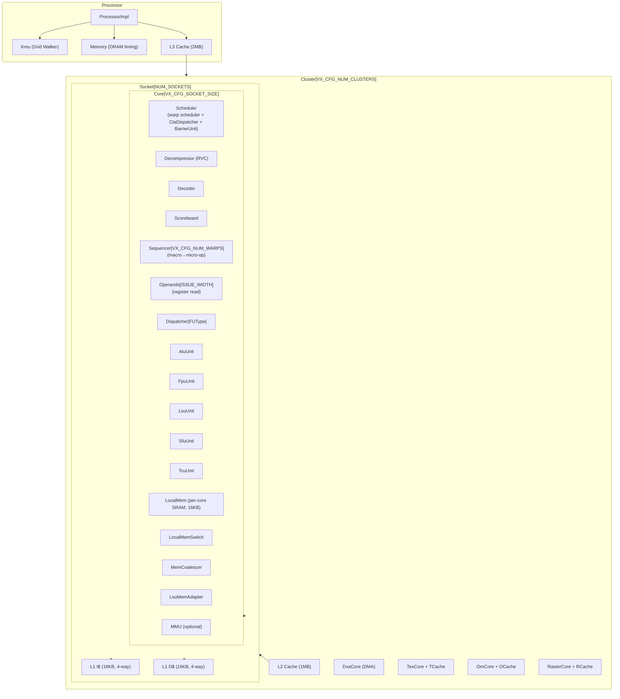
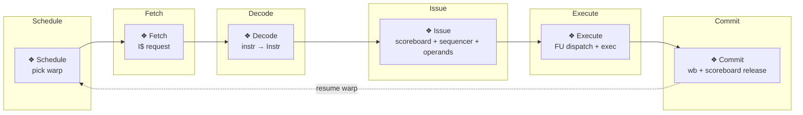
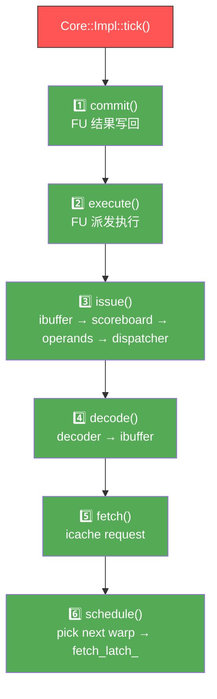
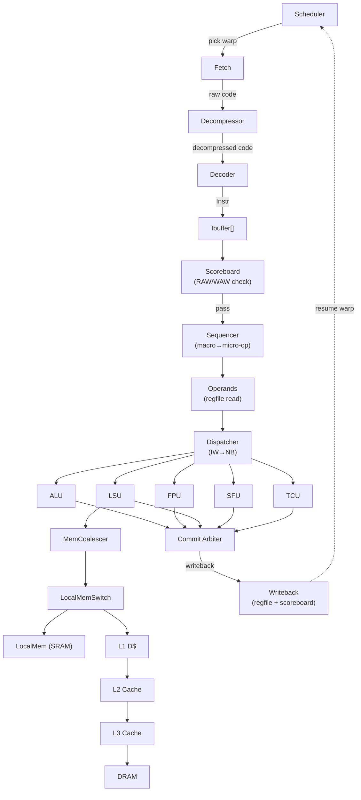
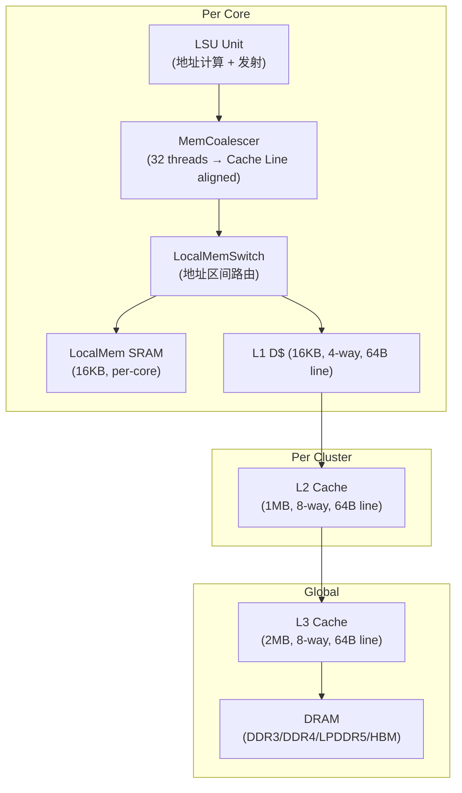
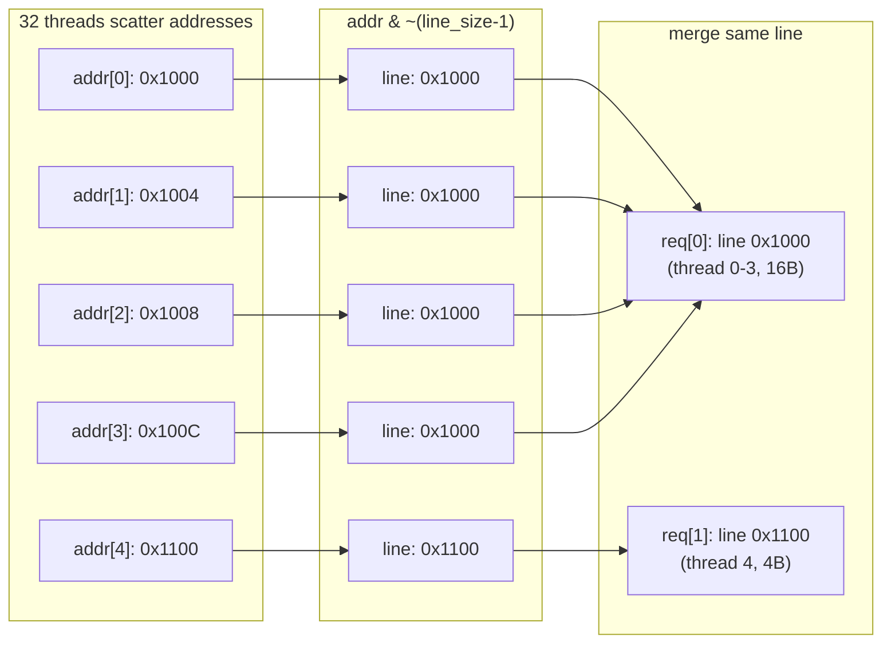
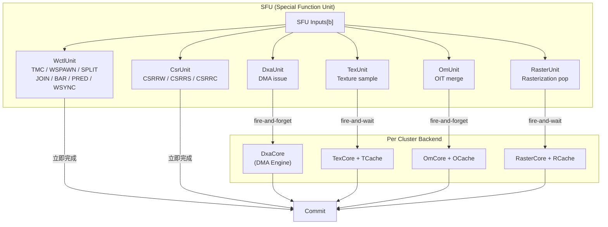
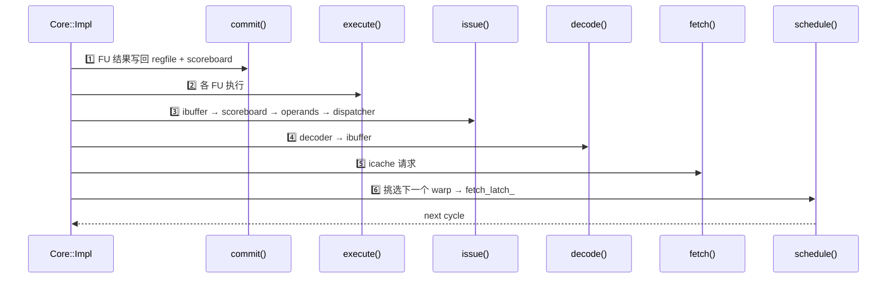

# Vortex simx GPGPU 模拟器微架构分析文档

> **代码路径**: `/home/daoyc/gpu-arc/vortex/sim/simx/`  
> **生成日期**: 2026-06-14  
> **分析范围**: 五级流水线、存储层次、模块层级、数据流

---

## 目录

1. [模块层级架构](#1-模块层级架构)
2. [五段流水线](#2-五段流水线)
3. [数据流图](#3-数据流图)
4. [存储层次](#4-存储层次)
5. [SFU 内部结构](#5-sfu-内部结构)
6. [单周期执行顺序](#6-单周期执行顺序)
7. [关键参数默认值](#7-关键参数默认值)
8. [文件与模块映射表](#8-文件与模块映射表)
9. [常见配置修改方法](#9-常见配置修改方法)

---

## 1. 模块层级架构



## 2. 五段流水线



### 反向流水线原理

Core 的 `tick()` 按 **逆序** 调用各阶段：



**为什么逆序**: commit 最先执行, 写回结果当前周期即可被 issue 的 RAW 检查看见, 避免浪费一个时钟周期。

## 3. 数据流图

### 指令流 (instr_trace_t 贯穿全程)



### 核心数据结构: `instr_trace_t`

| 字段 | 填充阶段 | 用途 |
|------|----------|------|
| `uuid` | 构造 | 全局唯一 ID |
| `cid / wid / cta_id` | Schedule | 核心 / Warp / CTA 标识 |
| `tmask` | Schedule | 活跃线程掩码 |
| `PC` | Schedule | 程序计数器 |
| `code` | Fetch | 原始指令字 |
| `fu_type / op_type` | Decode | 执行单元与操作类型 |
| `src_regs / dst_reg` | Decode | 源 / 目的寄存器描述符 |
| `src_data` | Issue (Operands) | 寄存器读取值 |
| `dst_data` | Execute | 执行结果 |
| `wb` | Decode | 是否需要写回 |

## 4. 存储层次



### 访存合并 (MemCoalescer) 原理



- **完美合并**: 32 个连续对齐地址 → 1 个请求 (32×4B=128B, 跨 2 条 64B Cache Line)
- **最差情况**: 32 个完全随机地址 → 32 个请求, 无合并
- AMO 原子操作跳过合并 (RISC-V RVA 不保证合并安全)

## 5. SFU 内部结构



## 6. 单周期执行顺序



## 7. 关键参数默认值

> 配置源: `VX_config.toml` + `VX_types.toml` (仓库根目录)

| 参数 | 默认值 | 说明 |
|------|--------|------|
| `VX_CFG_NUM_CLUSTERS` | 1 | 集群数 |
| `VX_CFG_NUM_CORES` | 1 | 总核心数 |
| `VX_CFG_SOCKET_SIZE` | 1 | 每 Socket 核心数 |
| `VX_CFG_NUM_WARPS` | 4 | 每 Core Warp 数 |
| `VX_CFG_NUM_THREADS` | 4 | 每 Warp 线程数 |
| `VX_CFG_NUM_BARRIERS` | 8 | Barrier slots |
| `VX_CFG_ISSUE_WIDTH` | 1 | 发射宽度 |
| `VX_CFG_IBUF_SIZE` | 4 | 每 Warp 指令缓冲深度 |
| `VX_CFG_NUM_ALU_BLOCKS` | 1 | ALU 块数 |
| `VX_CFG_NUM_FPU_BLOCKS` | 1 | FPU 块数 |
| `VX_CFG_NUM_LSU_BLOCKS` | 1 | LSU 块数 |
| `VX_CFG_NUM_SFU_BLOCKS` | 1 | SFU 块数 |
| `VX_CFG_ICACHE_SIZE` | 16384 (16KB) | L1 I$ |
| `VX_CFG_DCACHE_SIZE` | 16384 (16KB) | L1 D$ |
| `VX_CFG_L2_CACHE_SIZE` | 1048576 (1MB) | L2 Cache |
| `VX_CFG_L3_CACHE_SIZE` | 2097152 (2MB) | L3 Cache |
| `VX_CFG_LMEM_LOG_SIZE` | 14 (16KB) | 共享内存 |
| `VX_CFG_MEM_BLOCK_SIZE` | 64 | Cache Line / 传输块大小 |

### 默认配置总线程数

```text
1 cluster × 1 socket × 1 core × 4 warps × 4 threads = 16 threads
```

## 8. 文件与模块映射表

| 文件路径 (相对 `sim/simx/`) | 模块 | 流水阶段 |
|-----------------------------|------|----------|
| `scheduler.cpp` | Warp Scheduler | Schedule |
| `decompressor.cpp` | RVC 指令解压缩 | Fetch |
| `decode.cpp` | 指令译码器 | Decode |
| `sequencer.cpp` | Macro→Micro-op 分解 | Issue |
| `scoreboard.cpp` | 寄存器冒险表 | Issue |
| `operands.cpp` | 操作数收集 + 写回 | Issue / Commit |
| `dispatcher.cpp` | 发射宽度→功能块路由 | Execute |
| `func_unit.h` | FuncUnit CRTP 基类 | Execute |
| `alu_unit.cpp` | 整数 ALU | Execute |
| `fpu_unit.cpp` | 浮点 FPU | Execute |
| `lsu_unit.cpp` | 访存 LSU | Execute |
| `sfu_unit.cpp` | 特殊功能 SFU (入口) | Execute |
| `wctl_unit.cpp` | Warp 控制 (TMC/WSPAWN/..) | Execute (SFU 子级) |
| `csr_unit.cpp` | CSR 读写 | Execute (SFU 子级) |
| `tcu/tcu_unit.cpp` | Tensor Core | Execute |
| `mem/mem_coalescer.cpp` | 访存合并器 | LSU → Memory |
| `mem/cache.cpp` | Cache 模型 | Memory |
| `mem/local_mem.cpp` | 共享内存 | Memory |
| `mem/memory.cpp` | DRAM 时序模型 | Memory |
| `mem/lsu_mem_adapter.cpp` | LSU↔存储适配 | Memory |
| `mem/local_mem_switch.cpp` | LMEM 地址路由 | Memory |
| `mem/mmu.cpp` | 虚拟地址翻译 | Memory |
| `barrier_unit.cpp` | Warp 同步栅栏 | Scheduler 子级 |
| `cta_dispatcher.cpp` | CTA 调度 | Scheduler 子级 |
| `kmu/kmu.cpp` | Kernel Management Unit | Processor 级 |
| `dxa/dxa_unit.cpp` | DMA 引擎 | Execute (SFU 子级) |
| `tex/tex_unit.cpp` | 纹理单元 | Execute (SFU 子级) |
| `om/om_unit.cpp` | OIT 合并单元 | Execute (SFU 子级) |
| `raster/raster_unit.cpp` | 光栅化单元 | Execute (SFU 子级) |
| `core.cpp` | Core 顶层 (tick 编排) | 全部 |
| `cluster.cpp` | Cluster 顶层 | — |
| `processor_impl.h` | Processor 顶层 | — |
| `main.cpp` | 模拟入口 | — |
| `sim/common/simobject.h` | 仿真框架 (SimObject/SimChannel/SimPlatform) | 基础设施 |

## 9. 常见配置修改方法

### 通过环境变量 (运行时临时修改)

```bash
# 修改 Warp/Thread 数, 开启 L2 Cache
CONFIGS="-DVX_CFG_NUM_WARPS=8 -DVX_CFG_NUM_THREADS=16 -DVX_CFG_L2_ENABLE" \
./ci/blackbox.sh --driver=simx --app=demo
```

### 通过 VX_config.toml (永久修改)

编辑仓库根目录的 `VX_config.toml`, 然后重新构建:

```bash
cd build
../configure --xlen=64 --tooldir=$HOME/tools
make -s
```
